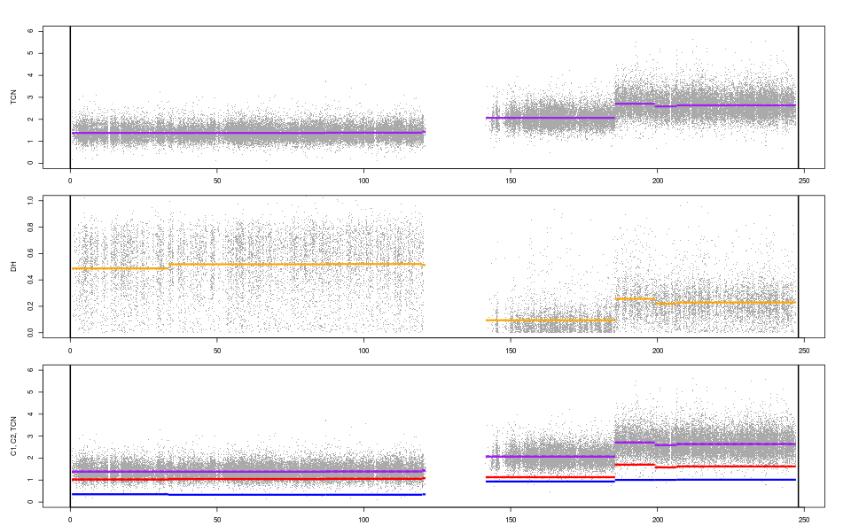

<div id="badges"><!-- pkgdown markup -->
<a href="https://CRAN.R-project.org/web/checks/check_results_PSCBS.html"></a> <a href="https://github.com/HenrikBengtsson/PSCBS/actions?query=workflow%3AR-CMD-check"></a>     <a href="https://app.codecov.io/gh/HenrikBengtsson/PSCBS"></a> 
</div>

# PSCBS: Analysis of Parent-Specific DNA Copy Numbers 

The PSCBS package implements the parent-specific copy-number segmentation presented in Olshen et al. (2011).  Package vignette ['Parent-specific copy-number segmentation using Paired PSCBS'](https://CRAN.R-project.org/package=PSCBS/vignettes/PairedPSCBS.pdf) provides a detailed introduction for running PSCBS segmentation.  It's available as:

```r
vignette("PairedPSCBS", package = "PSCBS")
```

Below is an excerpt of the example found in that vignette:

```r
library(PSCBS)

## Get single-chromosome example data
data <- exampleData("paired.chr01")
str(data)
# ’data.frame’: 73346 obs. of 6 variables:
# $ chromosome: int 1 1 1 1 1 1 1 1 1 1 ...
# $ x : int 1145994 2224111 2319424 2543484 2926730 2941694 3084986 3155127..
# $ CT : num 1.625 1.071 1.406 1.18 0.856 ...
# $ betaT : num 0.757 0.771 0.834 0.778 0.229 ...
# $ CN : num 2.36 2.13 2.59 1.93 1.71 ...
# $ betaN : num 0.827 0.875 0.887 0.884 0.103 ...

## Drop total copy-number outliers
data <- dropSegmentationOutliers(data)

## Identify chromosome arms from data
gaps <- findLargeGaps(data, minLength = 1e+06)
knownSegments <- gapsToSegments(gaps)

## Parent-specific copy-number segmentation
fit <- segmentByPairedPSCBS(data, knownSegments = knownSegments)

## Get segments as a data.frame
segments <- getSegments(fit, simplify = TRUE)
segments
#    chromosome tcnId dhId     start       end tcnNbrOfLoci  tcnMean
# 1           1     1    1    554484  33414619         9413 1.381375
# 2           1     1    2  33414619  86993745        17433 1.378570
# 3           1     2    1  86993745  87005243            2 3.185100
# 4           1     3    1  87005243 119796080        10404 1.389763
# 5           1     3    2 119796080 119932126           72 1.470789
# 6           1     3    3 119932126 120992603          171 1.439620
# 7           1     4    1 120992604 141510002            0       NA
# 8           1     5    1 141510003 185527989        13434 2.065400
# 9           1     6    1 185527989 199122066         4018 2.707400
# 10          1     7    1 199122066 206512702         2755 2.586100
# 11          1     8    1 206512702 206521352           14 3.871900
# 12          1     9    1 206521352 247165315        15581 2.637500
#    tcnNbrOfSNPs tcnNbrOfHets dhNbrOfLoci dhMean    c1Mean    c2Mean
# 1          2765         2765        2765 0.4868 0.3544608 1.0269140
# 2          4544         4544        4544 0.5185 0.3318907 1.0466792
# 3             0            0           0     NA        NA        NA
# 4          2777         2777        2777 0.5203 0.3333347 1.0564285
# 5             8            8           8 0.0767 0.6789900 0.7917995
# 6            52           52          52 0.5123 0.3510514 1.0885688
# 7             0            0          NA     NA        NA        NA
# 8          3770         3770        3770 0.0943 0.9353164 1.1300836
# 9          1271         1271        1271 0.2563 1.0067467 1.7006533
# 10          784          784         784 0.2197 1.0089669 1.5771331
# 11            9            9           9 0.2769 1.3998854 2.4720146
# 12         4492         4492        4492 0.2290 1.0167563 1.6207438

## Plot copy-number tracks
plotTracks(fit)
```




## Parallel processing

The package supports segmentation of the chromosomes in parallel
(asynchronously) via [futures](https://cran.r-project.org/package=future)
by adding the following

```r
future::plan("multisession")
```

to the beginning of the PSCBS script.  Everything else will work the
same.  To reset to non-parallel processing, use `future::plan("sequential")`.

To configure this automatically whenever the package is loaded, see
future vignette '[A Future for R: Controlling Default Future Strategy](https://CRAN.R-project.org/package=future/vignettes/future-5-startup.html)'.


## References

* Bengtsson H, Neuvial P, Speed TP. TumorBoost: Normalization of allele-specific tumor copy numbers from a single pair of tumor-normal genotyping microarrays, BMC Bioinformatics, 2010. DOI: [10.1186/1471-2105-11-245](https://doi.org/10.1186%2F1471-2105-11-245). PMID: [20462408](https://europepmc.org/article/MED/20462408), PMCID: [PMC2894037](https://www.ncbi.nlm.nih.gov/pmc/articles/PMC2894037/)

* Olshen AB, Bengtsson H, Neuvial P, Spellman PT, Olshen RA, Seshan VA. Parent-specific copy number in paired tumor-normal studies using circular binary segmentation, Bioinformatics, 2011. DOI: [10.1093/bioinformatics/btr329](https://doi.org/10.1093%2Fbioinformatics%2Fbtr329). PMID: [21666266](https://europepmc.org/article/MED/21666266). PMCID: [PMC3137217](https://www.ncbi.nlm.nih.gov/pmc/articles/PMC3137217/)

## Installation

R package PSCBS is available on [CRAN](https://cran.r-project.org/package=PSCBS) and can be installed in R as:

```r
# install.packages("BiocManager")
BiocManager::install(c("aroma.light", "DNAcopy"))

install.packages("PSCBS")
```

### Pre-release version
 
To install the pre-release version that is available in Git branch `develop` on GitHub, use:

```r
remotes::install_github("HenrikBengtsson/PSCBS", ref="develop")
```

This will install the package from source.  


<!-- pkgdown-drop-below -->

